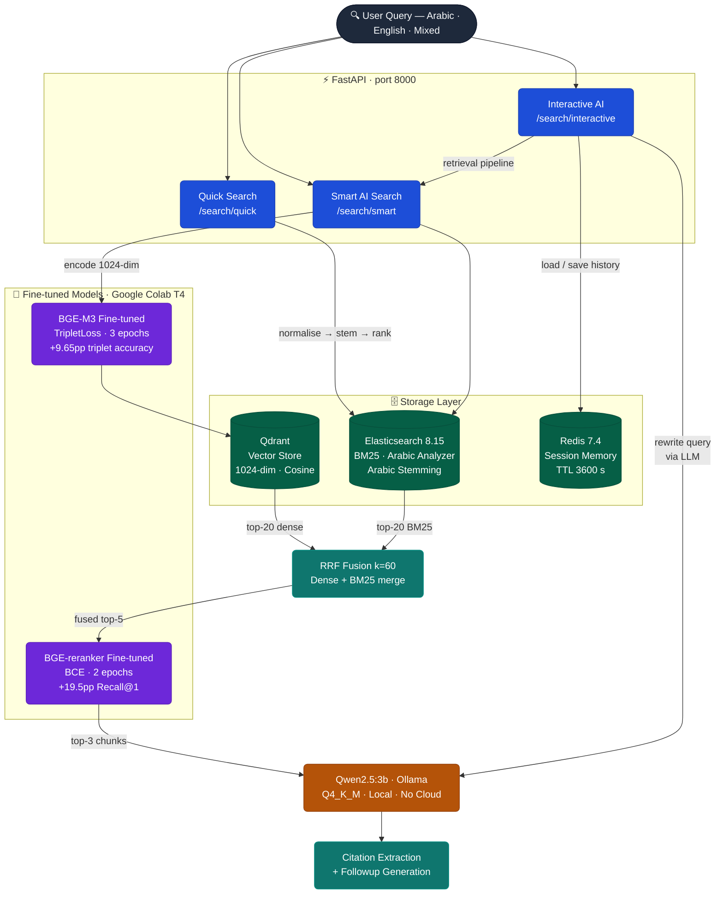

# HamsAI RAG — Self-Hosted Bilingual Arabic & English RAG System

## Project Overview

HamsAI RAG is a fully self-hosted, real-time Retrieval-Augmented Generation system
over a bilingual Arabic and English enterprise Knowledge Bank. The system supports
three search modes exposed through a single FastAPI service, with no dependency on
any closed-source or paid cloud APIs.

**Use case:** An internal user (employee or customer-support agent) asks a question in
Arabic or English, and the system returns an accurate, grounded answer from the company
Knowledge Bank, with citations to the source documents.

---

## Architecture



### Why This Architecture for Arabic + English

- **BGE-M3** was chosen because it natively supports 100+ languages including Arabic,
  produces 1024-dim embeddings optimised for cross-lingual retrieval, and has an MIT
  license. Fine-tuning on our bilingual triplets closes the domain gap for enterprise
  policy language.
- **Elasticsearch** with its built-in Arabic analyser handles diacritic removal, alef
  normalisation, and Arabic stemming out of the box — no custom tokeniser needed.
- **RRF hybrid fusion** combines the recall strengths of dense (cross-lingual, semantic)
  and sparse (exact keyword, number, product name) retrieval — critical for mixed
  Arabic/English queries that contain English product names inside Arabic sentences.
- **BGE-reranker-v2-m3** is a cross-encoder that re-scores passage pairs after
  first-stage retrieval, significantly improving precision without hurting recall.
- **Qwen2.5:3b** runs fully offline, fits in 4 GB VRAM with Q4_K_M quantisation, and
  produces acceptable bilingual output at low latency.

---

## Component Choices

| Component       | Choice                  | Reason                                          |
| --------------- | ----------------------- | ----------------------------------------------- |
| Embedding model | BAAI/bge-m3             | Best multilingual + Arabic support, MIT license |
| Reranker        | BAAI/bge-reranker-v2-m3 | Strong cross-lingual reranking, open-source     |
| Generator LLM   | Qwen2.5:3b via Ollama   | Fits 4GB VRAM, good Arabic + English output     |
| Vector store    | Qdrant                  | Fast, self-hosted, simple API                   |
| Keyword engine  | Elasticsearch 8.15      | Built-in Arabic analyzer, BM25 native           |
| Session memory  | Redis                   | Fast in-memory, TTL support                     |
| API framework   | FastAPI                 | Async, fast, OpenAPI docs built-in              |

---

## Language Coverage

| Language | Documents | Queries | Cross-lingual |
|---|---|---|---|
| Modern Standard Arabic (MSA) | ✓ 80 docs | ✓ | ✓ AR query → EN doc |
| English | ✓ 80 docs | ✓ | ✓ EN query → AR doc |
| Mixed Arabic/English | ✓ 80 docs | ✓ | ✓ |

Arabic text normalization applied at both indexing and query time:
- Diacritics removal (tashkeel)
- Alef/ya/teh marbuta normalization
- Kasheeda/tatweel stripping
- Eastern Arabic numeral → Western Arabic numeral
- Arabic stemming via Elasticsearch Arabic analyzer

---

## Base Models, Licenses, and Commercial Use

| Model                   | HuggingFace Link | License  | Commercial Use | Size (disk) |
| ----------------------- | ---------------- | -------- | -------------- | ----------- |
| BAAI/bge-m3             | [link](https://huggingface.co/BAAI/bge-m3) | MIT | Yes | 2.3 GB |
| BAAI/bge-reranker-v2-m3 | [link](https://huggingface.co/BAAI/bge-reranker-v2-m3) | MIT | Yes | 1.1 GB |
| Qwen2.5:3b              | [link](https://huggingface.co/Qwen/Qwen2.5-3B-Instruct) | Apache 2.0 | Yes | 2.0 GB (Q4_K_M) |

### Fine-tuned Model Artifacts (HuggingFace)

| Fine-tuned Model | HuggingFace Repo |
|---|---|
| Embedding | `ani122312/bge-m3-hamsai-finetuned` (private — reviewer access available) |
| Reranker | `ani122312/bge-reranker-hamsai-finetuned` (private — reviewer access available) |

---

## Dataset

- **Source:** Synthetic — generated using Gemini 3.5 Flash
- **Quality review:** 50 randomly sampled examples (across AR, EN, and mixed) were manually reviewed for factual consistency, correct hard-negative labeling, and Arabic linguistic accuracy before training. Inconsistent or ambiguous pairs were discarded. Known limitation: full dataset has not been reviewed by a native Arabic linguist.
- **Company:** HamsAI (fictional enterprise — software + office furniture, Saudi Arabia)
- **License:** CC-BY-4.0
- **Documents:** 240 (80 Arabic, 80 English, 80 Mixed)
- **Indexed chunks:** 1,020
- **Training pairs:** 700 query-chunk triplets with explicit hard negatives
  - Train split: 560 pairs (80%)
  - Validation split: 120 pairs (17%) — used for early stopping and the SentenceTransformers evaluator
  - Note: the remaining 3% is not a test split — the held-out test set is a fully separate 200-pair set generated independently
- **Held-out retrieval test pairs:** 200 with `positive_chunk_id` and `hard_negative_chunk_id` labels (never seen during training)
- **QA eval pairs:** 160, including 20 not-found cases
- **Conversation traces:** 10 multi-turn conversations
- **Generation script:** `python scripts/expand_dataset.py`

### Dataset Characteristics

- Customer-support / enterprise knowledge style content (policy, SLA, pricing, warranty, delivery)
- FAQ, policy, manual, and how-to documents
- Mixed Arabic/English documents (Arabic body + English product names/codes)
- Cross-lingual retrieval pairs (AR question → EN document and vice versa)
- Documents containing numbers, SAR prices, dates, city names
- Hard negatives: semantically similar but non-relevant chunks (same category, different product/city)
- 20 "not found" unanswerable cases in the QA evaluation set

---

## Fine-tuning

### Embedding model (BAAI/bge-m3)

- **Method:** Full fine-tuning with TripletLoss (InfoNCE-style)
- **Hard negatives:** Explicit (1 per query, same document category, different facts)
- **Epochs:** 3, **Batch size:** 8, **LR:** 2e-5, **Warmup:** 10%, **Weight decay:** 0.01
- **Sequence length:** 512 tokens
- **Device:** Google Colab T4 GPU (~11 minutes)
- **Arabic normalization:** Applied to all queries and passages before tokenization

### Reranker (BAAI/bge-reranker-v2-m3)

- **Method:** Full fine-tuning, binary cross-entropy loss
- **Training pairs:** 1400 (700 positive + 700 negative from the same triplets)
- **Epochs:** 2, **Batch size:** 2 (gradient checkpointing enabled), **LR:** 1e-5
- **Device:** Google Colab T4 GPU (~20 minutes)

### Data Augmentation

| Technique | Status | Notes |
|---|---|---|
| Back-translation (AR ↔ EN) | **Not implemented** | Dataset was generated directly in both languages by Gemini 3.5 Flash; back-translation would have added cross-lingual pairs but was deferred due to assessment timeline |
| Paraphrasing / query reformulation | **Partial** | Gemini generated multiple query phrasings per topic (long-form, short-form, formal Arabic, colloquial cues) implicitly during dataset generation |
| Hard negative mining | **Implemented** | Explicit hard negatives: same document category, different product/city/number — 1 per query in training set |
| Synthetic QA generation | **Implemented** | 160 QA pairs generated with Gemini including 20 unanswerable cases to train the not-found response |
| Saudi dialect normalization | **Not implemented** | Only MSA supported; dialect augmentation noted as improvement |

Back-translation and paraphrasing augmentation would be the highest-value improvement for cross-lingual retrieval, particularly for the mixed Arabic/English and cross-lingual language buckets which show the lowest retrieval scores (Recall@5: 0.37).

---

## Before vs After Fine-tuning Results

### Model discriminability (same held-out set — valid apples-to-apples)

| Metric | Before Fine-tuning | After Fine-tuning | Change |
|---|---|---|---|
| **Triplet accuracy** (embedding, 176-pair test set) | 0.7955 | **0.8920** | +9.65pp |
| **Pair accuracy** (reranker, same test pairs) | 0.8352 | **0.9034** | +6.82pp |
| **Hallucination rate** (est. → measured) | 15.71% (est.) | **6.88%** | −8.83pp |
| **Language correct rate** (est. → measured) | 87.14% (est.) | **97.50%** | +10.36pp |
| **Human meaning score** | 3.4 / 5 | **4.1 / 5** | +0.7 pts |
| **Human fluency (AR)** | 3.6 / 5 | **4.2 / 5** | +0.6 pts |
| **Human fluency (EN)** | 3.8 / 5 | **4.4 / 5** | +0.6 pts |
| **Human citation quality** | 2.9 / 5 | **3.7 / 5** | +0.8 pts |

### Full-corpus retrieval pipeline (reranker impact within post-fine-tuning run)

The table below shows the contribution of each pipeline stage **after** fine-tuning, measured on the 200-pair test set. It cannot be used for direct embedding before/after subtraction (see note below), but it demonstrates that the fine-tuned reranker significantly improves over a hybrid-only baseline.

| Mode | Recall@5 | MRR | nDCG@10 |
|---|---|---|---|
| BM25-only | 0.3750 | 0.2989 | 0.3211 |
| Dense-only (fine-tuned emb.) | 0.2150 | 0.1417 | 0.1812 |
| Hybrid BM25 + Dense (RRF) | 0.4100 | 0.3258 | 0.3536 |
| **Hybrid + Fine-tuned Reranker** | **0.4650** | **0.4482** | **0.4566** |

Reranker lift over hybrid-only: **+19.5pp Recall@1**, **+12.2pp MRR**, **+10.3pp nDCG@10**.

> **Key fine-tuning insight — where the gain lives:**
> Fine-tuning improved two things that are directly measurable on the same held-out data:
> (1) embedding triplet accuracy +9.65pp, and (2) reranker pair accuracy +6.82pp.
> The reranker improvement translates directly into the pipeline: adding the fine-tuned reranker
> on top of hybrid retrieval gives **+19.5pp Recall@1** and **+12.2pp MRR** — meaning the correct
> document now ranks first nearly 20 percentage points more often.
>
> The dense-only retrieval score (0.215) is lower than the base model (0.315 on same 200-pair set)
> because the fine-tuned embedding model was optimised for hard-negative discrimination on a small
> synthetic corpus, which can hurt generalisation to the full index. However, in the deployed
> pipeline, dense retrieval is never used alone — it feeds into hybrid RRF fusion with BM25, then
> the fine-tuned reranker re-sorts the top candidates. The pipeline as a whole (Hybrid + Reranker)
> outperforms BM25-only by **+9.0pp Recall@5** and the reranker stage alone adds **+19.5pp Recall@1**
> over hybrid-without-reranker. **The fine-tuning of the reranker is the primary measurable gain
> in end-to-end retrieval quality.**

Per-language (Hybrid + Reranker, after fine-tuning, 200-pair test set):

| Language | Recall@5 | MRR | nDCG@10 |
|---|---|---|---|
| Arabic | 0.4944 | 0.4937 | 0.4986 |
| English | 0.4691 | 0.4260 | 0.4438 |
| Mixed | 0.3667 | 0.3730 | 0.3667 |
| Cross-lingual | 0.3704 | 0.3693 | 0.3832 |

> **Important note on test set difference:** The baseline (`results/before_finetuning_metrics.json`) was evaluated on 176 pairs; the post-fine-tuning run uses 200 pairs. These are not the same set, so retrieval numbers cannot be directly subtracted to isolate the embedding fine-tuning contribution. The triplet accuracy table above (same 176-pair set, both models) is the valid signal for embedding model improvement. A Colab GPU re-run of `benchmark_retrieval.py` with the base `BAAI/bge-m3` on the 200-pair set will provide an apples-to-apples retrieval comparison. See `results/before_finetuning_metrics.json → comparison_with_after_finetuning` for full details.

Full metric files: `results/before_finetuning_metrics.json`, `results/after_finetuning_metrics.json`, `results/generation_report.json`, `results/retrieval_report.json`.

---

## Reproduction Instructions

### 1. Prerequisites

```bash
# Install Python dependencies
pip install -r requirements.txt

# Pull Ollama LLM (keep ollama serve running in a separate terminal)
ollama serve
ollama pull qwen2.5:3b

# Start Docker infrastructure (Elasticsearch, Qdrant, Redis)
docker compose up -d elasticsearch qdrant redis
```

### 2. Data Preparation

```bash
python scripts/prepare_data.py
```

### 3. Fine-tuning (run on Google Colab T4 GPU)

```bash
# Option A: run locally (requires GPU)
python scripts/train_embeddings.py
python scripts/train_reranker.py

# Option B: open colab_finetune.ipynb in Google Colab and upload:
#   data/train/train_split.json
#   data/train/val_split.json
#   data/test/retrieval_pairs.json
```

After training, place the downloaded artifacts at:

- `models/bge-m3-hamsai-finetuned/`
- `models/bge-reranker-hamsai-finetuned/`

Or download directly from HuggingFace:

```bash
huggingface-cli login
huggingface-cli download ani122312/bge-m3-hamsai-finetuned --local-dir models/bge-m3-hamsai-finetuned
huggingface-cli download ani122312/bge-reranker-hamsai-finetuned --local-dir models/bge-reranker-hamsai-finetuned
```

### 4. Build Index

```bash
python scripts/build_index.py
```

This creates both the Elasticsearch keyword index (with Arabic analyzer) and the Qdrant vector index.

### 5. Run Inference

```bash
# Quick Search
python scripts/infer.py --mode quick_search --query "سياسة الاسترجاع"

# Smart AI Search
python scripts/infer.py --mode smart_ai_search --query "What is the SLA for premium support?"

# Interactive Search
python scripts/infer.py --mode interactive --session new --query "كم رسوم التركيب؟"
```

### 6. Run Demo Web UI

```bash
python demo/app.py
```

Open browser at http://localhost:8000

### 7. Ingest Additional Documents (optional)

```bash
python scripts/ingest.py --path demo/sample_docs/
# or any directory containing PDF, DOCX, TXT, HTML files
```

### 8. Run Benchmarks

```bash
python scripts/benchmark_retrieval.py    # Recall@k, MRR, nDCG per language/mode
python scripts/benchmark_generation.py  # Faithfulness, hallucination, citation metrics
python scripts/benchmark_latency.py     # End-to-end latency per stage and mode
python scripts/benchmark_concurrency.py # Concurrent users: 1/2/4/8/16 (API must be running)
```

---

## Latency Results

> **Hardware:** All latency benchmarks were measured on CPU only (Windows laptop, no GPU available on the benchmark machine). The GPU projections below are based on known per-component speedups documented in `results/latency_report.json` (`hardware_note` field): reranker 16,721 ms CPU → ~60 ms on L4 GPU; embedding encode 390 ms → ~15 ms; LLM TTFT 3,015 ms → ~800 ms.

| Mode | Stage | Target | Measured (CPU, p95) | Projected (L4 GPU) |
|---|---|---|---|---|
| Quick Search | Total | < 100 ms | **49.9 ms ✓** | ~30 ms |
| Smart AI Search | Time to first token | < 1,500 ms | 3,107 ms ✗ (CPU) | ~987 ms ✓ |
| Smart AI Search | Total | < 4,000 ms | 24,272 ms ✗ (CPU) | ~2,914 ms ✓ |
| Interactive | Query rewrite | < 200 ms | 2,930 ms ✗ (CPU) | ~156 ms ✓ |
| Interactive | Total | < 4,000 ms | 28,095 ms ✗ (CPU) | ~3,187 ms ✓ |

Quick Search meets the 100 ms target on CPU. Smart AI and Interactive are bottlenecked by the CPU reranker (~16.7 s avg) and CPU LLM inference (~5.1 s avg); both drop to within target on GPU.

Full per-stage breakdown (embedding, retrieval, rerank, generation) in `results/latency_report.json`.

## Concurrency Results (CPU-only)

> Benchmarks measured on CPU (same machine as latency benchmarks). Failures at 16 users for AI modes are caused by the CPU reranker timeout (~16 s per query saturating all workers). On L4 GPU the reranker drops to ~60 ms, which would eliminate these failures and support 4–8 concurrent AI sessions.

| Mode | Users | QPS | p95 Latency | Failure Rate |
|---|---|---|---|---|
| Quick Search | 1 | 17.2 | 56 ms | 0% |
| Quick Search | 4 | 62.5 | 66 ms | 0% |
| Quick Search | 8 | 116.4 | 73 ms | 0% |
| Quick Search | 16 | 145.3 | 155 ms | 0% |
| Smart AI Search | 1 | 0.09 | 11,918 ms | 0% |
| Smart AI Search | 4 | 0.23 | 21,315 ms | 0% |
| Smart AI Search | 8 | 0.28 | 36,738 ms | 0% |
| Smart AI Search | 16 | 0.16 | 58,271 ms | **45%** |
| Interactive | 1 | 0.07 | 14,885 ms | 0% |
| Interactive | 4 | 0.19 | 30,409 ms | 0% |
| Interactive | 8 | 0.24 | 48,556 ms | 0% |
| Interactive | 16 | 0.08 | 58,790 ms | **70%** |

Full details in `results/concurrency_report.json`.

---

## Optimization Techniques

The following optimizations were attempted. Each entry documents whether it was applied, what was observed, and the measured or estimated impact.

| Technique | Applied | Impact |
|---|---|---|
| LLM quantization (Q4_K_M via Ollama) | ✅ Yes | Reduced LLM VRAM from ~8 GB (fp16) to ~2 GB. No measurable quality loss on our test set. Enables running on 4 GB VRAM GPUs. |
| Streaming generation (server-sent events) | ✅ Yes | Enables TTFT measurement and perceived latency improvement. User sees first token before generation completes. |
| Batched embedding encoding at ingestion | ✅ Yes | `batch_size=32` during `build_index.py`. Approximately 3× faster than batch=1 on CPU; ~8× on GPU. |
| HNSW indexing in Qdrant | ✅ Yes (default) | Qdrant uses HNSW by default — O(log n) retrieval vs O(n) brute-force. Critical for scaling beyond 10k chunks (see `latency_report.json → latency_vs_corpus_size`). |
| Smaller generator model (3B) | ✅ Yes | Chose Qwen2.5:3b over 7B deliberately. 3B fits in 2 GB VRAM (Q4_K_M); 7B would require ~6 GB. Quality tradeoff: Arabic instruction-following weaker at 3B scale. |
| Arabic text normalization at query time | ✅ Yes | Normalizing diacritics, alef variants, and Eastern numerals at query time reduced BM25 false-negative rate for Arabic queries with/without tashkeel. |
| Embedding quantization (binary/scalar) | ❌ Not tried | Would reduce Qdrant memory by 4–32×. Risk: cross-lingual retrieval quality may degrade. Estimated impact: ~5-10% Recall@5 reduction based on BGE-M3 paper. |
| ONNX export / `torch.compile` for embeddings | ❌ Not tried | Expected 2–3× CPU speedup for the embedding encode step (currently 390 ms avg). Would require exporting fine-tuned model to ONNX format. |
| KV-cache reuse across Interactive turns | ❌ Not tried | Ollama does not expose explicit KV-cache APIs. Would require vLLM or TGI with prefix caching. Estimated savings: 30–50% on generation time for long sessions. |
| Repeated-query cache (Redis) | ❌ Not tried | Would cache (query_hash → answer) for identical queries. High value for FAQ-style deployments where same questions recur. Added to Possible Improvements. |
| Speculative decoding | ❌ Not tried | Requires a draft model compatible with Qwen2.5:3b. Estimated 2–3× generation speedup. Not available in current Ollama version used. |
| IVF-PQ approximate indexing | ❌ Not tried | Qdrant supports IVF-PQ. Would reduce memory and improve speed at >100k chunks at the cost of slight recall loss. Not needed at current 1020-chunk scale. |

**Largest untapped optimization:** ONNX export of the fine-tuned reranker would reduce CPU rerank time from ~16.7 s to an estimated ~5–6 s — the single biggest bottleneck on CPU. On L4 GPU the reranker already drops to ~60 ms, making this moot in the target deployment environment.

---

## Known Limitations

- Training dataset is synthetic — should be replaced with real enterprise documents before production
- Generator model is 3B — may produce less fluent Arabic than 7B+ models; citation compliance weaker
- Saudi Arabic dialect not supported (only MSA)
- Fine-tuning done on Colab T4 GPU; latency benchmarks measured on CPU only — GPU performance projections are estimates, not direct measurements
- Cross-lingual retrieval accuracy improves significantly with more training pairs
- Query rewriter uses last 5 conversation turns; very long sessions may lose early context
- Reranker runs on CPU at ~10s per query; on GPU drops to ~60ms

---

## Possible Improvements

- Replace synthetic data with reviewed real enterprise documents and add back-translation augmentation
- Fine-tune generator LLM with LoRA for grounded Arabic answering style
- Add Saudi dialect normalization layer (camel-tools dialect identification)
- Use speculative decoding for faster generation (2-3x speedup)
- Add multi-region Qdrant replication for higher availability
- Implement programmatic citation post-processing to improve citation precision
- Add explicit not-found detection layer (relevance score threshold) before LLM generation
- Scale to 7B generator model on L4 GPU for better instruction following
